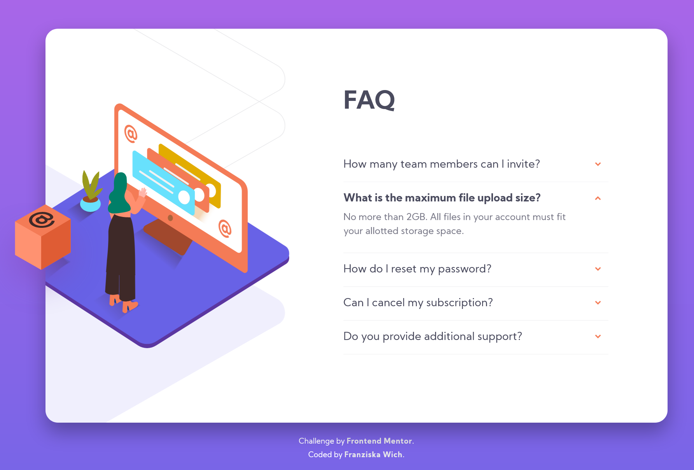
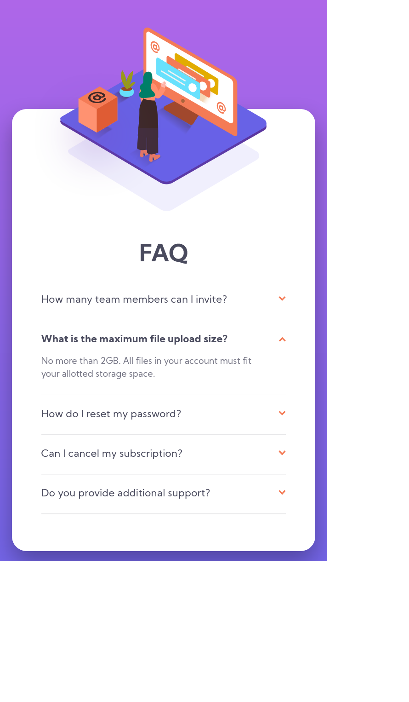

# Frontend Mentor - FAQ accordion card solution

This is a solution to the [FAQ accordion card challenge on Frontend Mentor](https://www.frontendmentor.io/challenges/faq-accordion-card-XlyjD0Oam). Frontend Mentor challenges help you improve your coding skills by building realistic projects.

## Table of contents

- [Overview](#overview)
  - [The challenge](#the-challenge)
  - [Screenshot](#screenshot)
  - [Links](#links)
- [My process](#my-process)
  - [Built with](#built-with)
  - [What I learned](#what-i-learned)
  - [Continued development](#continued-development)
  - [Useful resources](#useful-resources)
- [Author](#author)
- [Acknowledgments](#acknowledgments)

## Overview

### The challenge

Users should be able to:

- View the optimal layout for the component depending on their device's screen size
- See hover states for all interactive elements on the page
- Hide/Show the answer to a question when the question is clicked

### Screenshot




### Links

- Solution URL: [https://github.com/franziskawich/faq-accordion-card](https://github.com/franziskawich/faq-accordion-card)
- Live Site URL: [Add live site URL here](https://your-live-site-url.com)

## My process

### Built with

- Semantic HTML5 markup
- SCSS (saved as CSS)
- Flexbox
- Mobile-first workflow
- BEM

### What I learned

I have learned that it is possible to build a faq accordion without JavaScript with the HTML-elements details and summary (sadly not supported in IE... 😶):

```html
<details>
  <summary>
    <h3>Question</h3>
  </summary>
  <div>
    <p>Answer</p>
  </div>
</details>
```

I rotated the arrow next to the questions using the transform-origin property which I never used before and found very helpful.

```css
::after {
  transform: rotate(180deg);
  transform-origin: center;
}
```

On Stack Overflow I learned that it is possible to make the opening of the accordion more fluid with an animation:

```css
@keyframes sweep {
  0% {
    opacity: 0;
    margin-top: -2rem;
  }
  100% {
    opacity: 1;
    margin-top: 0rem;
  }
```

I struggled to position the different images correctly, but this gave me the opportunity to practise this further.

### Continued development

In Firefox (and other browsers as well I asume) a scrollbar is shown when opening the accordion. This moves the whole container a few pixels to the left side which is not ideal. I fixed it with Chrome at least.

I had a weird issue with my image-box (my image) and content-box (the faq) and it still confuses me. I moved my content a bit upwards (margin-top: -X) and then it was obviously overlapped by my image-box because I could not click on my first question anymore. I thought a z-index would help me out but it actually did not. There must be something else going on or maybe I am just too blind and I do not see the real issue which causes this behavior.🤨 So I was sort of forced to set a hight on my image-box. That's probably not too bad but I thought I could solve it without setting a height.

### Useful resources

- [CSS-Tricks: Two Issues Styling the Details Element and How to Solve Them](https://css-tricks.com/two-issues-styling-the-details-element-and-how-to-solve-them/) - This is an amazing article which helped me ...
- [CSS-Tricks: Quick Reminder that Details/Summary is the Easiest Way Ever to Make an Accordion](https://css-tricks.com/quick-reminder-that-details-summary-is-the-easiest-way-ever-to-make-an-accordion/) - This ...
- [Stack Overflow: How To Add CSS3 Transition With HTML5 details/summary tag reveal?](https://stackoverflow.com/questions/38213329/how-to-add-css3-transition-with-html5-details-summary-tag-reveal) - This helped me ...

## Author

- Frontend Mentor - [@franziskawich](https://www.frontendmentor.io/profile/franziskawich)
- freeCodeCamp - [Franziska Wich](https://www.freecodecamp.org/fcc35fab9df-6b8c-445e-8aec-36ee00e99ba0)

## Acknowledgments

I looked at Riyana Gueco's solution on Frontend Mentor a few times because she solved this challenge without JavaScript as well. It helped me a lot when I got stuck and gave me some new ideas to try out.
